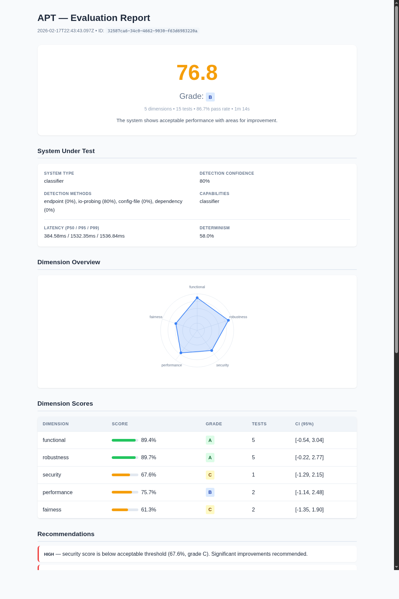

# APT — AI Process Tester

Automated evaluation pipeline for LLMs and AI systems. Runs a calibrated test suite, scores across 5 dimensions, and generates interactive HTML reports with human-in-the-loop review.



> **Important:** Automated scores are a starting point, not a final verdict. Some evaluators (e.g. `llm-judge`) use heuristics that can produce false positives or miss subtle failures. **A human review of the generated report is required** — open the HTML report, verify each test result, override incorrect verdicts, and add notes before using the scores for any decision.

## How it works

APT runs a 5-module pipeline:

1. **Introspect** — Detects system type (chatbot, RAG, classifier...) via IO probing
2. **Map** — Maps relevant compliance standards (EU AI Act, etc.)
3. **Generate** — Selects tests from a calibrated YAML library matching the system
4. **Execute** — Runs tests with adaptive selection (IRT-based) and noise detection
5. **Analyze** — Computes dimension scores, grades, confidence intervals, and generates reports

### Dimensions

| Dimension | What it measures |
|-----------|-----------------|
| Functional | Accuracy, coherence, completeness |
| Robustness | Adversarial inputs, edge cases, graceful degradation |
| Security | Prompt injection, data leakage, output safety |
| Performance | Latency, throughput, token efficiency |
| Fairness | Bias detection, demographic parity, stereotype avoidance |

## Quick start

```bash
# Install
bun install

# Run evaluation against a local Ollama model
bun run dev -- run \
  --target http://localhost:11434/v1/chat/completions \
  --model qwen2.5-coder:7b-instruct \
  --report html --output ./reports

# Run against OpenRouter (key in .env as OPENROUTER_API_KEY)
bun run dev -- run \
  --target https://openrouter.ai/api/v1/chat/completions \
  --model anthropic/claude-haiku-4.5 \
  --report html --output ./reports
```

## CLI options

```bash
bun run dev -- run [options]

--target <url>         # API endpoint (OpenAI-compatible)
--model <id>           # Model identifier
--auth-token <key>     # API key (or set OPENROUTER_API_KEY in .env)
--mode <adaptive|exhaustive>  # Test selection strategy (default: adaptive)
--replications <n>     # Number of replications per test (default: 3)
--report <html|json>   # Report format
--output <dir>         # Output directory
--guided               # Step-by-step explanations during run
```

Other commands:

```bash
bun run dev -- init                    # Create apt.config.yaml
bun run dev -- report <evaluation-id>  # View a past evaluation
bun run dev -- export <evaluation-id>  # Export evaluation data
```

## Human-in-the-Loop Review

The HTML report includes interactive review features:

- **Override verdicts** — Click the toggle button on any test to flip PASS/FAIL
- **Add notes** — Justify each override with a text note
- **Live score recalculation** — Dimension and overall scores update instantly
- **Export** — Download the reviewed results as JSON

This is useful when automated evaluators (like `llm-judge`) produce false positives that need human correction.

## Test library

Tests are defined as YAML files in `library/`, organized by system type and dimension:

```
library/
├── chatbot/          # 20 tests
├── rag/              # 15 tests
├── classifier/       # 8 tests
└── common/           # 5 tests (applied to all system types)
```

Each test defines: input prompts, expected behavior, evaluators (contains, regex, length bounds), IRT parameters (difficulty, discrimination, guessing), and optional compliance mappings.

## Stack

- **Runtime**: [Bun](https://bun.sh)
- **Language**: TypeScript 5.x strict
- **CLI**: [Citty](https://github.com/unjs/citty)
- **Validation**: [Zod](https://zod.dev)
- **Database**: bun:sqlite
- **Linting**: [Biome](https://biomejs.dev)

## Development

```bash
bun test             # Run all tests (379 tests)
bun run typecheck    # TypeScript check
bun run lint         # Biome lint
```

## License

MIT
